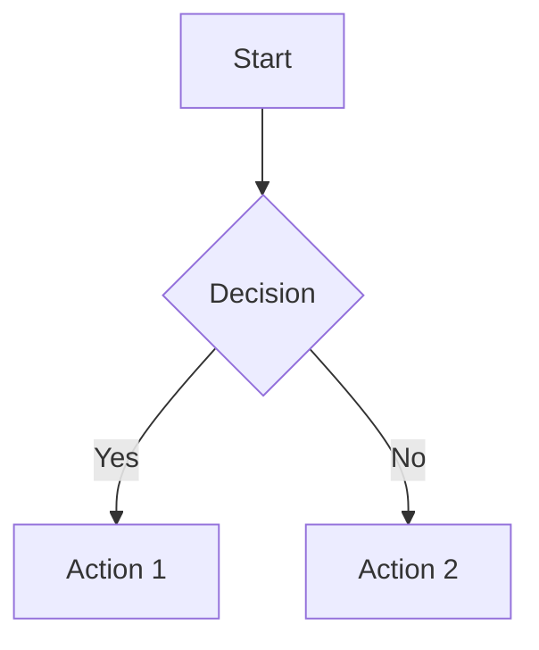

# Markdown to PDF

A CLI tool that converts Markdown to beautifully styled PDFs, following GitHub's rendering specification.


## Features

- **GitHub-style rendering** - Matches GitHub's Markdown output exactly
- **Mermaid diagrams** - Flowcharts, sequence diagrams, Gantt charts, class diagrams
- **LaTeX math** - Full support for inline and block equations
- **Syntax highlighting** - Code blocks with highlight.js
- **Dark theme** - GitHub dark mode support
- **Batch conversion** - Convert multiple files at once

## Quick Start

### Using npx (No Global Installation)

If you already have the project cloned, use npx to run without global installation:

```bash
# From the project directory
npx . input.md -o output.pdf
```

### Local Installation

Clone and build:

```bash
git clone https://github.com/KrabsWong/the-worst-markdown-to-pdf.git
cd the-worst-markdown-to-pdf
npm install
npm run build
```

Then use with npx:

```bash
npx . input.md
```

## Usage

### Single file

```bash
# Using node directly
node dist/cli.js input.md

# Using npx (after build)
npx . input.md

# Using the bin command
npm link
md2pdf input.md
```

### With options

```bash
# Custom output path
node dist/cli.js input.md -o output.pdf

# Set document title
node dist/cli.js input.md -t "Document Title"

# Dark theme
node dist/cli.js input.md --theme github-dark

# Landscape orientation
node dist/cli.js input.md --landscape

# Custom margins
node dist/cli.js input.md --margin 30mm
```

### Batch conversion

```bash
node dist/cli.js batch "docs/*.md" -o ./pdfs
```

## Options

| Option | Description | Default |
|--------|-------------|---------|
| `-o, --output` | Output PDF path | Same as input |
| `-t, --title` | Document title | Filename |
| `--theme` | Theme: github-light, github-dark | github-light |
| `--no-mermaid` | Disable Mermaid diagrams | false |
| `--no-latex` | Disable LaTeX rendering | false |
| `--landscape` | Landscape orientation | false |
| `--margin` | Page margins | 20mm |

## Supported Syntax

### Markdown

All standard Markdown syntax plus:

- Headers with anchor links
- Task lists
- Tables
- Footnotes
- Strikethrough

### GitHub Alerts

```markdown
> [!NOTE]
> Important information.

> [!TIP]
> Helpful advice.

> [!WARNING]
> Caution advised.
```

### Mermaid Diagrams

````markdown

````

### LaTeX Math

```markdown
Inline: $E = mc^2$

Block:
$$
\int_{a}^{b} f(x) dx = F(b) - F(a)
$$
```

## Technical Details

### How It Works

1. **Markdown Parsing**: Uses `marked` library with GitHub Flavored Markdown (GFM)
2. **Mermaid Rendering**: Server-side pre-rendering using Playwright for reliable SVG output
3. **LaTeX Rendering**: KaTeX formulas rendered in browser with CDN
4. **PDF Generation**: Playwright prints the rendered HTML to PDF

### Table Layout

Wide tables automatically adjust to fit the page:
- Text wraps within cells
- Font size reduces slightly for print
- Tables can span multiple pages with repeating headers

### Mermaid Diagram Support

All Mermaid diagram types are supported:
- Flowcharts (`graph TD`, `graph LR`)
- Sequence diagrams
- Gantt charts
- Class diagrams
- State diagrams
- Entity Relationship diagrams

## Troubleshooting

### Mermaid diagrams not rendering

Mermaid diagrams are pre-rendered on the server side. If you see raw code:
- Check your internet connection (Mermaid library loads from CDN during rendering)
- Try running with `--no-mermaid` to skip diagram rendering
- Check the mermaid code syntax is valid

### PDF generation is slow

First run requires downloading Chromium (~100MB). Subsequent runs are faster.

## License

MIT
