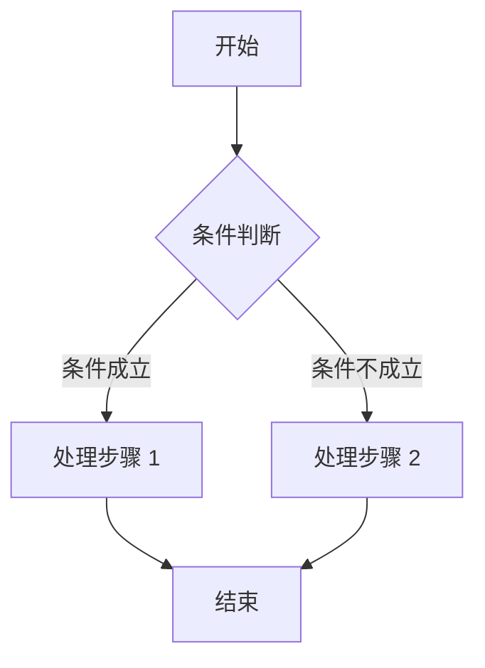
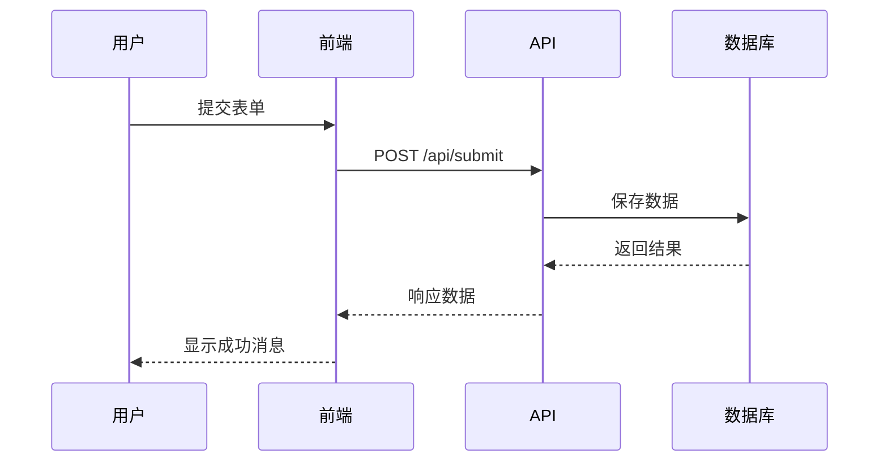
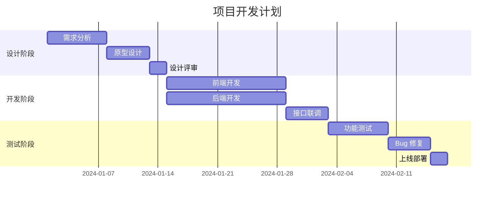
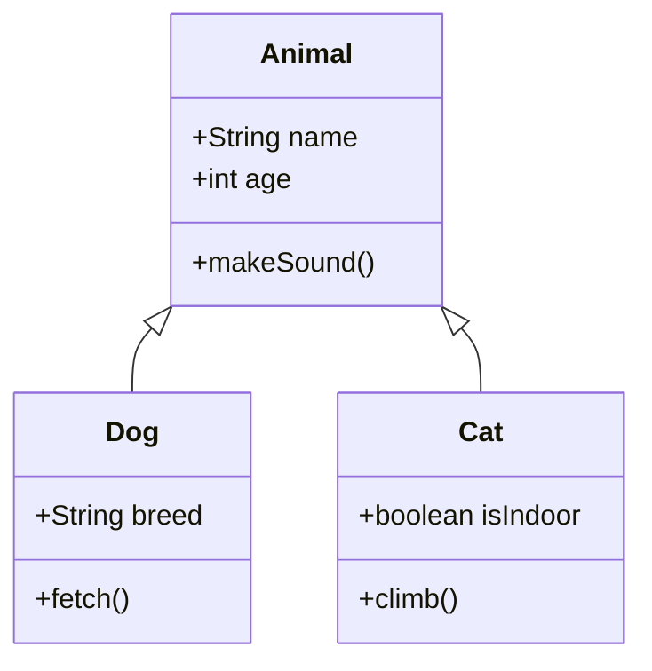

# Markdown to PDF 示例文档

这是一个示例文档，展示了所有支持的 Markdown 语法和特性。

---

## 目录

1. [基础排版](#基础排版)
2. [代码示例](#代码示例)
3. [表格](#表格)
4. [Mermaid 图表](#mermaid-图表)
5. [LaTeX 数学公式](#latex-数学公式)
6. [GitHub 警告框](#github-警告框)
7. [列表](#列表)

---

## 基础排版

### 标题

Markdown 支持六级标题，从 H1 到 H6。

#### 四级标题

##### 五级标题

###### 六级标题

### 文本格式

这是**粗体**文本，这是*斜体*文本，这是~~删除线~~文本。

还可以组合使用：***粗斜体***，**~~粗体删除线~~**。

### 引用

> 这是一段引用文本。
> 
> 引用可以有多行，并且可以**包含格式**。

> 嵌套引用：
>> 这是嵌套的引用块。
>> 
>> 可以有多层嵌套。

### 链接和图片

[访问 GitHub](https://github.com)

---

## 代码示例

### 行内代码

使用 `console.log()` 来输出信息。

### 代码块

#### JavaScript

```javascript
function fibonacci(n) {
  if (n <= 1) return n;
  return fibonacci(n - 1) + fibonacci(n - 2);
}

// 生成斐波那契数列
const sequence = [];
for (let i = 0; i < 10; i++) {
  sequence.push(fibonacci(i));
}
console.log(sequence); // [0, 1, 1, 2, 3, 5, 8, 13, 21, 34]
```

#### TypeScript

```typescript
interface User {
  id: number;
  name: string;
  email: string;
  isActive: boolean;
}

class UserManager {
  private users: User[] = [];

  addUser(user: User): void {
    this.users.push(user);
  }

  getUserById(id: number): User | undefined {
    return this.users.find(user => user.id === id);
  }

  getActiveUsers(): User[] {
    return this.users.filter(user => user.isActive);
  }
}
```

#### Python

```python
def quicksort(arr):
    """快速排序算法实现"""
    if len(arr) <= 1:
        return arr
    
    pivot = arr[len(arr) // 2]
    left = [x for x in arr if x < pivot]
    middle = [x for x in arr if x == pivot]
    right = [x for x in arr if x > pivot]
    
    return quicksort(left) + middle + quicksort(right)

# 测试
numbers = [3, 6, 8, 10, 1, 2, 1]
print(quicksort(numbers))  # [1, 1, 2, 3, 6, 8, 10]
```

#### SQL

```sql
SELECT 
    u.id,
    u.name,
    u.email,
    COUNT(o.id) as order_count,
    SUM(o.total) as total_spent
FROM users u
LEFT JOIN orders o ON u.id = o.user_id
WHERE u.created_at >= '2024-01-01'
GROUP BY u.id, u.name, u.email
HAVING COUNT(o.id) > 5
ORDER BY total_spent DESC
LIMIT 100;
```

#### Bash

```bash
#!/bin/bash

# 备份脚本
BACKUP_DIR="/backup/$(date +%Y%m%d)"
SOURCE_DIR="/home/user/documents"

echo "开始备份..."
mkdir -p "$BACKUP_DIR"

tar -czf "$BACKUP_DIR/backup_$(date +%H%M%S).tar.gz" -C "$SOURCE_DIR" .

if [ $? -eq 0 ]; then
    echo "备份成功: $BACKUP_DIR"
else
    echo "备份失败!"
    exit 1
fi
```

---

## 表格

### 基础表格

| 功能 | 支持 | 说明 |
|------|------|------|
| Markdown | ✓ | 标准 Markdown 语法 |
| Mermaid | ✓ | 流程图、时序图等 |
| LaTeX | ✓ | 数学公式 |
| 代码高亮 | ✓ | 多主题支持 |

### 对齐表格

| 左对齐 | 居中对齐 | 右对齐 |
|:-------|:--------:|-------:|
| 内容 1 | 内容 2   | 内容 3 |
| 数据 A | 数据 B   | 数据 C |
| 长文本内容 | 中等长度 | 短 |

---

## Mermaid 图表

### 流程图



### 时序图



### 甘特图



### 类图



---

## LaTeX 数学公式

### 行内公式

质能方程 $E = mc^2$ 展示了质量和能量的等价性。

一元二次方程的解为 $x = \\frac{-b \\pm \\sqrt{b^2 - 4ac}}{2a}$。

### 块级公式

#### 定积分

$$
\\int_{a}^{b} f(x) \\mathrm{d}x = F(b) - F(a)
$$

#### 高斯积分

$$
\\int_{-\\infty}^{+\\infty} e^{-x^2} \\mathrm{d}x = \\sqrt{\\pi}
$$

#### 泰勒展开

$$
f(x) = f(a) + f'(a)(x-a) + \\frac{f''(a)}{2!}(x-a)^2 + \\frac{f'''(a)}{3!}(x-a)^3 + \\cdots
$$

#### 矩阵

$$
\\mathbf{A} = \\begin{bmatrix}
a_{11} & a_{12} & a_{13} \\\\
a_{21} & a_{22} & a_{23} \\\\
a_{31} & a_{32} & a_{33}
\\end{bmatrix}
$$

#### 偏微分方程

$$
\\frac{\\partial u}{\\partial t} = \\alpha \\left( \\frac{\\partial^2 u}{\\partial x^2} + \\frac{\\partial^2 u}{\\partial y^2} \\right)
$$

#### 麦克斯韦方程组

$$
\\begin{aligned}
\\nabla \\cdot \\mathbf{E} &= \\frac{\\rho}{\\varepsilon_0} \\\\
\\nabla \\cdot \\mathbf{B} &= 0 \\\\
\\nabla \\times \\mathbf{E} &= -\\frac{\\partial \\mathbf{B}}{\\partial t} \\\\
\\nabla \\times \\mathbf{B} &= \\mu_0\\mathbf{J} + \\mu_0\\varepsilon_0\\frac{\\partial \\mathbf{E}}{\\partial t}
\\end{aligned}
$$

---

## GitHub 警告框

> [!NOTE]
> 这是重要信息的提示。用于提供额外的上下文信息。

> [!TIP]
> 这是一个有用的提示。可以帮助用户更好地使用功能。

> [!IMPORTANT]
> 这是关键信息。用户需要注意的重要内容。

> [!WARNING]
> 这是警告信息。需要注意的潜在问题。

> [!CAUTION]
> 谨慎操作。可能会导致数据丢失或其他严重后果。

---

## 列表

### 无序列表

- 第一项
- 第二项
  - 嵌套项 2.1
  - 嵌套项 2.2
    - 更深层的嵌套
- 第三项

### 有序列表

1. 第一步
2. 第二步
   1. 子步骤 2.1
   2. 子步骤 2.2
3. 第三步

### 任务列表

- [x] 已完成的功能
- [x] 另一个已完成的功能
- [ ] 待实现的功能
- [ ] 规划中功能
  - [ ] 子任务 A
  - [ ] 子任务 B

---

## 其他元素

### 水平线

上方内容

---

下方内容

### 键盘快捷键

使用 <kbd>Ctrl</kbd> + <kbd>C</kbd> 复制选中的内容。

使用 <kbd>Cmd</kbd> + <kbd>V</kbd> 粘贴内容。

### 脚注

这是一个带有脚注的句子[^1]。

[^1]: 这是脚注的内容。

---

## 结语

这个示例文档展示了 Markdown to PDF 工具支持的绝大多数特性。包括：

1. ✅ 完整的 GitHub Markdown 语法
2. ✅ 代码高亮（多种语言）
3. ✅ Mermaid 图表（流程图、时序图、甘特图、类图）
4. ✅ LaTeX 数学公式（行内和块级）
5. ✅ GitHub 风格的警告框
6. ✅ 任务列表
7. ✅ 表格
8. ✅ 美观的 PDF 输出

**感谢您的使用！**
