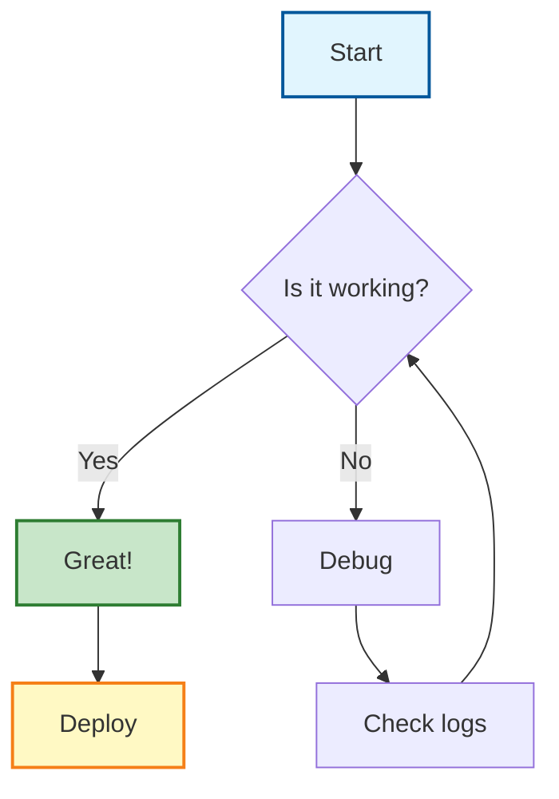
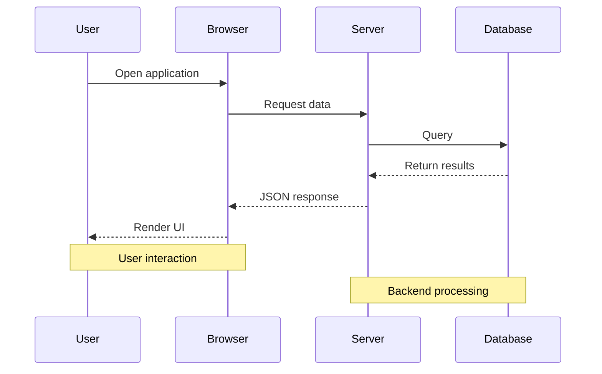

# Embed Content Test Document

This document tests various embed capabilities in Markdown to PDF conversion.

## 1. Images

### Local Image


### Remote Image


### Image with Link
[](https://github.com)

## 2. HTML Embeds (Raw HTML)

<div style="padding: 20px; background: #f6f8fa; border-radius: 8px; border: 1px solid #d0d7de;">
  <h3>Custom HTML Block</h3>
  <p>This is a custom HTML div block that should render with styling.</p>
  <ul>
    <li>Item 1</li>
    <li>Item 2</li>
  </ul>
</div>

## 3. Iframes (if supported)

<iframe src="https://example.com" width="100%" height="300px" style="border: 1px solid #ccc;"></iframe>

## 4. Video Embeds

### YouTube Embed
<iframe width="560" height="315" src="https://www.youtube.com/embed/dQw4w9WgXcQ" frameborder="0" allowfullscreen></iframe>

## 5. Audio

<audio controls>
  <source src="https://www.soundhelix.com/examples/mp3/SoundHelix-Song-1.mp3" type="audio/mpeg">
  Your browser does not support the audio element.
</audio>

## 6. Complex Mermaid with Styling



## 7. Mermaid Sequence with Notes



## 8. Advanced LaTeX

### Matrix Operations
$$
\mathbf{A} = \begin{bmatrix} 
a_{11} & a_{12} & a_{13} \\
a_{21} & a_{22} & a_{23} \\
a_{31} & a_{32} & a_{33}
\end{bmatrix}, \quad
\mathbf{A}^{-1} = \frac{1}{\det(\mathbf{A})} \text{adj}(\mathbf{A})
$$

### Complex Equations
$$
\oint_{\partial \Omega} \mathbf{E} \cdot d\mathbf{l} = -\frac{d}{dt} \int_{\Omega} \mathbf{B} \cdot d\mathbf{A}
$$

## 9. Tables with Rich Content

| Feature | Status | Priority | Notes |
|---------|--------|----------|-------|
| **PDF Generation** | ✅ Working | High | Core functionality |
| **Mermaid Charts** | ✅ Working | High | Server-side rendering |
| *LaTeX Math* | ✅ Working | Medium | KaTeX integration |
| ~~Deprecated Feature~~ | ❌ Removed | N/A | Use alternative |

## 10. Code with Annotations

```typescript
// Example: PDF Generator Options
interface PDFOptions {
  format: 'A4' | 'Letter' | 'Legal';  // Page size
  landscape?: boolean;                 // Orientation
  margin?: {
    top: string;    // e.g., '20mm'
    right: string;
    bottom: string;
    left: string;
  };
  printBackground: boolean;  // Include background colors
}

// Usage
const options: PDFOptions = {
  format: 'A4',
  landscape: false,
  margin: {
    top: '25mm',
    right: '20mm',
    bottom: '25mm',
    left: '20mm'
  },
  printBackground: true
};
```

## 11. Details/Summary (Collapsible)

<details>
<summary>Click to expand configuration details</summary>

### Advanced Settings

```javascript
module.exports = {
  // Rendering options
  mermaid: {
    theme: 'default',
    securityLevel: 'loose'
  },
  
  // PDF output
  pdf: {
    scale: 1.5,
    preferCSSPageSize: true
  }
};
```

</details>

## 12. Definition Lists

Term 1
: Definition for term 1 with **bold** and *italic* text.

Term 2
: Definition for term 2.
: Another definition for term 2.

## 13. Emoji Test

Standard emoji: 🎉 🚀 ✨ 💯 🔥

## 14. Task Lists with Nesting

- [x] Core PDF generation
- [x] Mermaid diagram support
  - [x] Flowcharts
  - [x] Sequence diagrams
  - [x] Gantt charts
- [x] LaTeX math formulas
- [ ] Advanced table layouts
- [ ] Custom fonts

## Conclusion

This test document demonstrates the full range of embed capabilities supported by the Markdown to PDF converter.

---

**Generated:** $(date)
**Version:** 1.0.0
