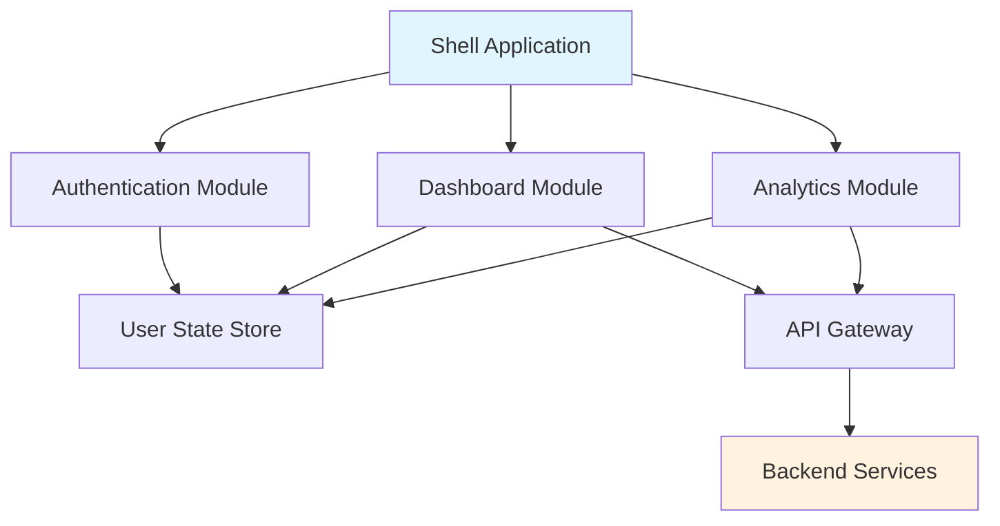
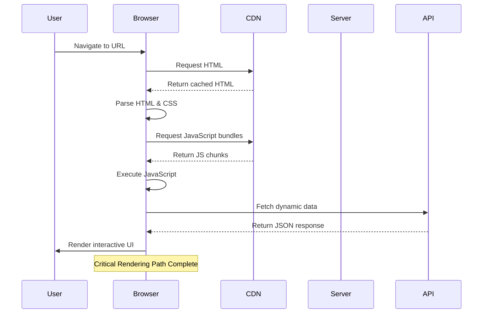
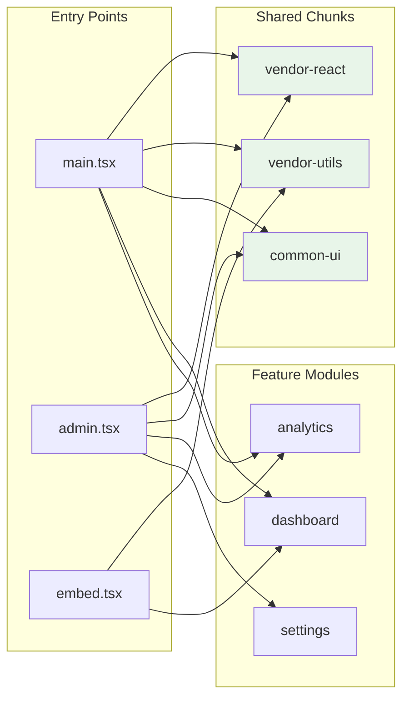
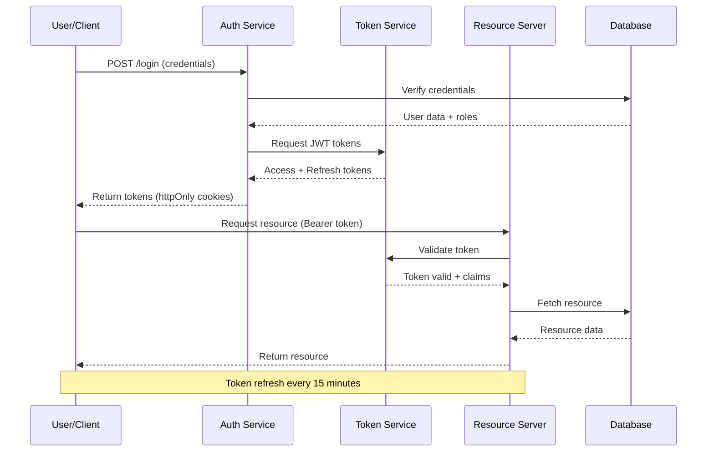
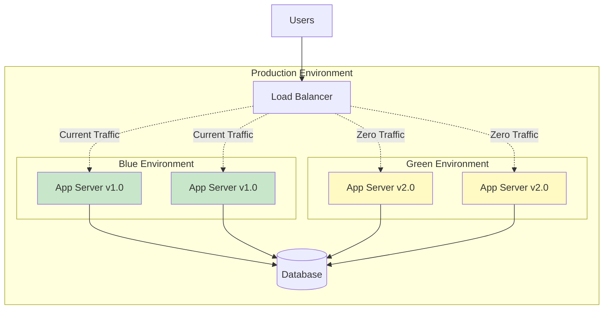

# Modern Web Architecture: A Technical Deep Dive

This document explores contemporary web development patterns, performance metrics, and architectural decisions that shape enterprise applications in 2024.

---

## Executive Summary

The landscape of web development has evolved significantly over the past decade. Organizations now face critical decisions regarding **monolithic versus micro-frontend architectures**, state management strategies, and performance optimization techniques. This analysis examines quantitative metrics, architectural trade-offs, and implementation patterns derived from production systems at scale.

---

## 1. System Architecture Overview

### 1.1 Monolithic vs Micro-Frontend Comparison

Modern applications require careful architectural planning. The following table compares key characteristics:

| Architecture | Bundle Size | Initial Load | Team Autonomy | Deployment Complexity | Best For |
|-------------|-------------|--------------|---------------|---------------------|----------|
| Monolithic | Large (2-5MB) | Higher | Low | Simple | Small teams, rapid prototyping |
| Micro-Frontend | Small (200-500KB) | Lower | High | Complex | Large organizations, multiple teams |
| Module Federation | Medium (500KB-1MB) | Moderate | Medium | Moderate | Medium to large teams |

### 1.2 Component Communication Flow

The interaction between micro-frontends follows a specific orchestration pattern:



The shell application acts as the orchestrator, managing module lifecycle and shared state through a centralized store.

---

## 2. Performance Analysis

### 2.1 Core Web Vitals Benchmarks

Performance metrics directly impact user engagement and conversion rates. Industry standards established by Google provide measurable targets:

| Metric | Good | Needs Improvement | Poor | Weight in Score |
|--------|------|------------------|------|----------------|
| LCP (Largest Contentful Paint) | <= 2.5s | <= 4.0s | > 4.0s | 25% |
| FID (First Input Delay) | <= 100ms | <= 300ms | > 300ms | 25% |
| CLS (Cumulative Layout Shift) | <= 0.1 | <= 0.25 | > 0.25 | 25% |
| TTFB (Time to First Byte) | <= 800ms | <= 1800ms | > 1800ms | 15% |
| FCP (First Contentful Paint) | <= 1.8s | <= 3.0s | > 3.0s | 10% |

### 2.2 Load Performance Sequence

Understanding the critical rendering path helps optimize perceived performance:



---

## 3. State Management Mathematics

### 3.1 Redux State Update Complexity

The time complexity of Redux operations follows predictable patterns. For a state tree with $n$ reducers and $m$ actions:

$$
T_{update} = O(1) + O(n) + O(m \log m)
$$

Where:
- $O(1)$ represents action dispatch overhead
- $O(n)$ accounts for reducer iteration
- $O(m \log m)$ covers selector memoization with $m$ connected components

### 3.2 Memory Usage Estimation

Memory consumption for normalized state structures can be estimated using:

$$
M_{total} = \sum_{i=1}^{k} (s_i \times e_i) + O(k^2)
$$

Variables:
- $k$ = number of entity types
- $s_i$ = average size of entity type $i$
- $e_i$ = count of entities of type $i$
- $O(k^2)$ = relationship mapping overhead

### 3.3 Selector Performance

Reselect library implements memoization with the following cache hit rate formula:

$$
\eta_{cache} = \frac{H_{hit}}{H_{hit} + H_{miss}} = \frac{n_{unique}}{n_{total}}
$$

Optimal selector design achieves $\eta_{cache} > 0.85$ in production applications.

---

## 4. Implementation Patterns

### 4.1 React Component Optimization

Proper memoization prevents unnecessary re-renders:

```typescript
import React, { memo, useMemo, useCallback } from 'react';
import { useSelector, useDispatch } from 'react-redux';

interface DataTableProps {
  dataset: Array<{
    id: string;
    value: number;
    category: string;
    timestamp: Date;
  }>;
  onRowSelect: (id: string) => void;
  filterCriteria: string;
}

const DataTable: React.FC<DataTableProps> = memo(({
  dataset,
  onRowSelect,
  filterCriteria
}) => {
  // Memoized filtered data computation
  const filteredData = useMemo(() => {
    return dataset
      .filter(item => item.category.includes(filterCriteria))
      .sort((a, b) => b.timestamp.getTime() - a.timestamp.getTime());
  }, [dataset, filterCriteria]);

  // Memoized callback prevents child re-renders
  const handleRowClick = useCallback((id: string) => {
    onRowSelect(id);
  }, [onRowSelect]);

  return (
    <table className="data-table">
      <thead>
        <tr>
          <th>ID</th>
          <th>Value</th>
          <th>Category</th>
          <th>Timestamp</th>
        </tr>
      </thead>
      <tbody>
        {filteredData.map(item => (
          <tr 
            key={item.id} 
            onClick={() => handleRowClick(item.id)}
          >
            <td>{item.id}</td>
            <td>{item.value.toFixed(2)}</td>
            <td>{item.category}</td>
            <td>{item.timestamp.toLocaleDateString()}</td>
          </tr>
        ))}
      </tbody>
    </table>
  );
});

DataTable.displayName = 'DataTable';

export default DataTable;
```

### 4.2 API Integration Pattern

Modern data fetching leverages React Query for server state management:

```typescript
import { useQuery, useMutation, useQueryClient } from '@tanstack/react-query';
import { apiClient } from './api-client';

// Query key factory for type-safe cache management
const queryKeys = {
  users: ['users'] as const,
  user: (id: string) => ['users', id] as const,
  analytics: (range: DateRange) => ['analytics', range] as const,
};

// Hook for fetching user data with caching
export const useUserData = (userId: string) => {
  return useQuery({
    queryKey: queryKeys.user(userId),
    queryFn: () => apiClient.get(`/users/${userId}`),
    staleTime: 5 * 60 * 1000, // 5 minutes
    cacheTime: 10 * 60 * 1000, // 10 minutes
  });
};

// Mutation with optimistic updates
export const useUpdateUser = () => {
  const queryClient = useQueryClient();
  
  return useMutation({
    mutationFn: (data: UserUpdate) => 
      apiClient.patch(`/users/${data.id}`, data),
    
    onMutate: async (newData) => {
      await queryClient.cancelQueries({ 
        queryKey: queryKeys.user(newData.id) 
      });
      
      const previousData = queryClient.getQueryData(
        queryKeys.user(newData.id)
      );
      
      queryClient.setQueryData(
        queryKeys.user(newData.id),
        (old: any) => ({ ...old, ...newData })
      );
      
      return { previousData };
    },
    
    onError: (err, newData, context) => {
      queryClient.setQueryData(
        queryKeys.user(newData.id),
        context?.previousData
      );
    },
    
    onSettled: (data, error, variables) => {
      queryClient.invalidateQueries({ 
        queryKey: queryKeys.user(variables.id) 
      });
    },
  });
};
```

---

## 5. Build System Architecture

### 5.1 Module Bundling Strategy

Modern build tools implement sophisticated dependency graphs:



### 5.2 Chunk Loading Performance

The probability of cache hits for shared chunks follows:

$$
P_{cache\_hit} = 1 - \prod_{i=1}^{n} (1 - p_i)
$$

Where $p_i$ represents the probability that chunk $i$ is already cached from previous page loads.

---

## 6. Database Query Optimization

### 6.1 Query Execution Analysis

Complex query performance can be modeled as:

$$
T_{query} = T_{parse} + T_{plan} + \sum_{i=1}^{n} (R_i \times C_i)
$$

Components:
- $T_{parse}$ = SQL parsing time
- $T_{plan}$ = Query planning time
- $R_i$ = Rows processed at step $i$
- $C_i$ = Cost per row at step $i$
- $n$ = Number of execution steps

### 6.2 Index Selectivity

Index effectiveness is measured by selectivity:

$$
S = \frac{D}{N}
$$

Where:
- $S$ = Selectivity (optimal: 0.01 to 0.10)
- $D$ = Number of distinct values
- $N$ = Total number of rows

---

## 7. Security Implementation

### 7.1 Authentication Flow



---

## 8. Real-Time Data Processing

### 8.1 WebSocket Connection Scaling

Maximum concurrent connections per server can be estimated:

$$
C_{max} = \frac{M_{available}}{M_{per\_connection}}
$$

Typical values:
- $M_{available}$ = 4GB - 8GB for Node.js
- $M_{per\_connection}$ = 50KB - 200KB per WebSocket

Therefore:

$$
C_{max} \approx \frac{6 \times 10^9}{100 \times 10^3} = 60,000\ connections
$$

### 8.2 Event Throughput

Message throughput with batching:

$$
\lambda_{effective} = \frac{\lambda_{raw}}{B_{size}} \times (1 - P_{drop})
$$

Where:
- $\lambda_{raw}$ = Raw event generation rate
- $B_{size}$ = Batch size
- $P_{drop}$ = Message drop probability

---

## 9. Monitoring and Observability

### 9.1 Error Rate Calculations

System reliability metrics:

$$
SLI = \frac{N_{successful}}{N_{total}} \times 100
$$

$$
Error\ Rate = \frac{N_{4xx} + N_{5xx}}{N_{total}} \times 1000\ (errors/1000\ requests)
$$

Target SLOs for enterprise applications:

| Service Level | Availability | Max Error Rate | Latency P99 |
|--------------|--------------|----------------|-------------|
| Critical | 99.99% | 0.1% | 200ms |
| Standard | 99.9% | 0.5% | 500ms |
| Internal | 99.0% | 1.0% | 1000ms |

---

## 10. Deployment Architecture

### 10.1 Blue-Green Deployment Flow



---

## Conclusion

Modern web architecture requires balancing multiple competing concerns: performance, maintainability, scalability, and developer experience. The mathematical models and architectural patterns presented here provide a framework for making informed technical decisions.

Key takeaways:

1. **Measure before optimizing** - Use Core Web Vitals as quantitative benchmarks
2. **Architecture follows team structure** - Conway's Law applies to frontend architecture
3. **State management has costs** - Every selector and reducer adds complexity
4. **Performance is a feature** - Sub-second load times directly impact business metrics
5. **Security is non-negotiable** - Implement defense in depth at every layer

---

## References

- Google Chrome Developers. (2024). Core Web Vitals. https://web.dev/vitals/
- Martin Fowler. (2014). Microservices. https://martinfowler.com/articles/microservices.html
- Redux Team. (2024). Redux Style Guide. https://redux.js.org/style-guide/style-guide
- React Query Documentation. (2024). https://tanstack.com/query/latest
